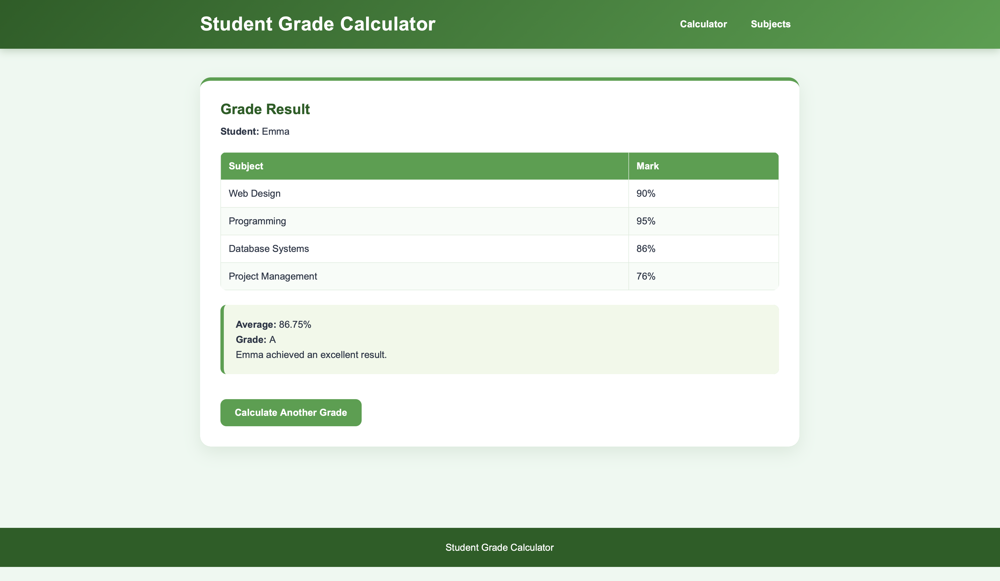
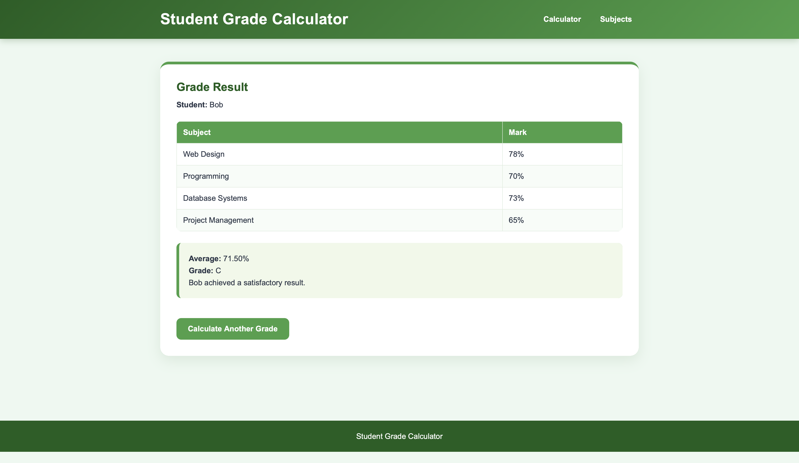
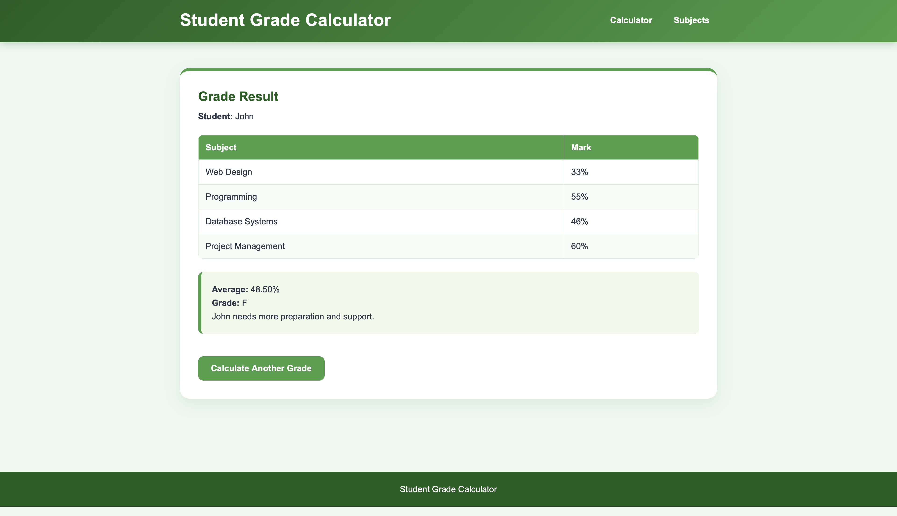

# Week 8 – Learning Experiment

## Learning Activities

This week I conducted a learning experiment while developing my **Student Grade Calculator** using PHP. I wanted to investigate whether testing the program with a variety of input values would help me identify programming errors more effectively than testing with only one example.

## Estimated Hours of Explicit Learning Activity

Approximately **1.5 hours**.

---

## Learning Experiment

### Hypothesis

Testing the Student Grade Calculator with a variety of input values will help identify programming errors more effectively than testing with only one example.

---

### Experiment

While developing the Student Grade Calculator, I deliberately tested the program using different combinations of student marks instead of using the same values repeatedly.

The tests included:

- High marks (e.g. 95, 90, 88, 92) to check that the program assigned **Grade A** correctly.
- Good marks (e.g. 80, 76, 79, 78) to verify **Grade B**.
- Average marks (e.g. 70, 68, 66, 72) to verify **Grade C**.
- Passing marks (e.g. 55, 58, 60, 52) to verify **Grade D**.
- Low marks (e.g. 40, 45, 35, 48) to verify **Grade F**.
- Boundary values such as **0, 50, 65, 75, 85, and 100** to ensure the grading conditions worked correctly at the grade thresholds.

For each test case, I checked whether the calculated average matched the expected value and whether the correct grade was displayed. I also confirmed that the result page showed the correct student information and subject marks.

---

### Results

Testing a wide range of input values helped verify that every grading condition worked correctly.

Using different mark combinations allowed me to check all possible grade outcomes instead of only confirming that one example worked. Testing boundary values such as 50, 65, 75, 85, 0, and 100 also helped confirm that the grade calculation behaved correctly at important grade thresholds.

The results supported my hypothesis because testing multiple scenarios increased my confidence that the program would produce correct results for different users.

---

## Learning Insights

This experiment showed me that using a variety of test cases is an effective way to verify whether a program works correctly.

Instead of assuming the program was correct after one successful test, I learned that different input values can reveal problems that may not appear with a single example. Testing both typical values and boundary values gave me greater confidence that the grade calculation, PHP conditions, and functions were working as intended.

In future programming projects, I will continue creating multiple test cases before considering a program complete. This approach improves software quality, makes debugging easier, and helps ensure that the program behaves correctly for different users.
